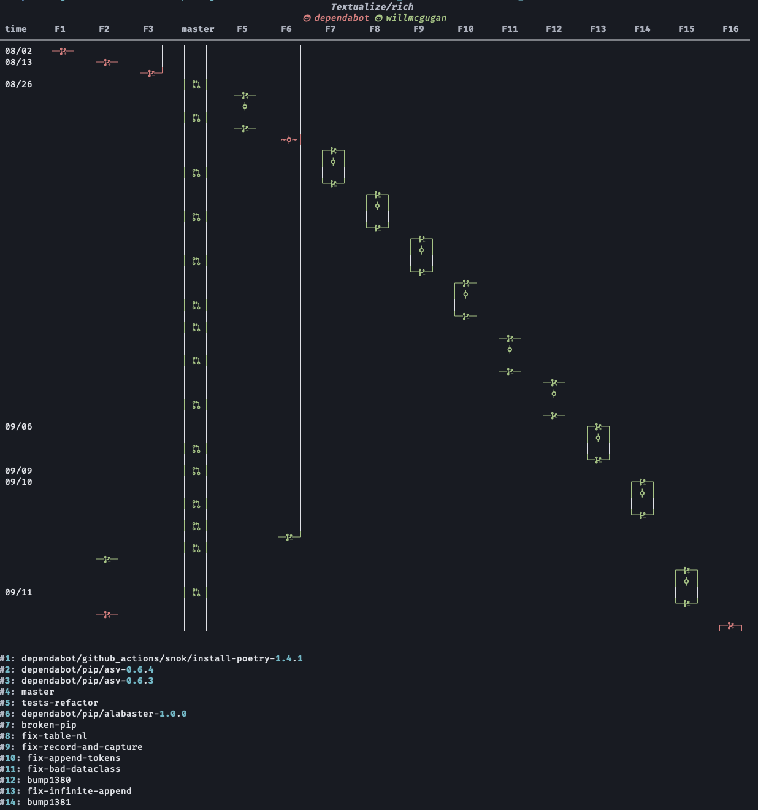
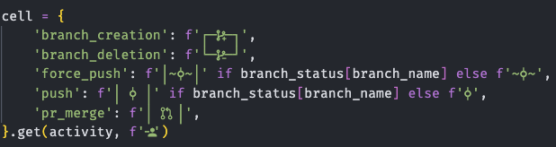

# gitflow-visualizer


The **gitflow-visualizer** is a Python-based tool designed to visually analyze and track the workflow of a GitHub repository. It displays branch activities (e.g., branch creation, deletion, pull request merges) and other important events, allowing teams to easily understand the history of the repository's development process. For more information, see [GitHub API - List repository activities](https://docs.github.com/en/rest/repos/repos?apiVersion=2022-11-28#list-repository-activities).

```bash
gitflow-visualizer https://github.com/Textualize/rich --start_date 2024-08-01 --end_date 2024-09-22
```



## Table of Contents

- [Features](#features)
- [Installation](#installation)
- [Usage](#usage)
- [Customization](#customization)
- [Font Recommendation](#font-recommendation)
- [License](#license)
- [Contributing](#contributing)

## Features

- Visualize GitHub repository activities such as:
    
  - Branch creation 
  - Branch deletion
  - Pushes and force-pushes
  - Pull request merges
- Different colors for each user's activities
- Filter activities by date range
- Highlight active branches
- Abstract branch name like `release`, `hotfix`, and `feature` for better visualization.

## Installation 

You can install the latest stable version of **gitflow-visualizer** from PyPI:

```bash
pip install gitflow-visualizer
```

Or, if you prefer to install the latest development version from the GitHub repository, use:

```bash
git clone https://github.com/Verssae/gitflow-visualizer.git
cd gitflow-visualizer
pip install .
```

### GitHub Token
You can pass a GitHub API token directly using the `--token` option for increased rate limits or to access private repositories.

Alternatively, you can set the `GITHUB_TOKEN` environment variable, and the tool will use it automatically if `--token` is not provided.


## Usage

Once installed, you can use the tool to visualize a GitHub repository's workflow. Below are some example commands:

```bash
gitflow-visualizer https://github.com/SoftClassTeam4/Invaders
```

```bash
gitflow-visualizer https://github.com/SoftClassTeam4/Invaders --start_date 2023-10-17 --end_date 2023-10-19
```

```bash
usage: gitflow-visualizer [-h] [--core_branches [CORE_BRANCHES ...]] [--start_date START_DATE] [--end_date END_DATE] [--token TOKEN] url

Visualize GitHub Repository Workflow Activities

positional arguments:
  url                   GitHub repository URL

options:
  -h, --help            show this help message and exit
  --core_branches [CORE_BRANCHES ...]
                        List of core branch names. Other branch names would be abstracted (release->R, hotfix->H, feature->F)
  --start_date START_DATE
                        Start date in YYYY-MM-DD format
  --end_date END_DATE   End date in YYYY-MM-DD format
  --token TOKEN         GitHub API token
```

You can find some example outputs in the `images` directory.

## Customization

- **Core Branches**: By default, the tool includes `main`, `master`, and `develop` as core branches. You can override this using the `--core_branches` argument.
- **Date Range**: Use `--start_date` and `--end_date` to filter activities within a specific date range.

## Font Recommendation

For the best visual experience, it is recommended to use the **Fira Code** font. You can download and install it [here](https://github.com/tonsky/FiraCode) or via the following command on macOS:

```bash
brew tap homebrew/cask-fonts
brew install font-fira-code-nerd-font
```

## License

This project is licensed under the MIT License - see the [LICENSE](LICENSE) file for details.

## Contributing

Contributions are welcome! If you'd like to contribute to this project, feel free to fork the repository and create a pull request.